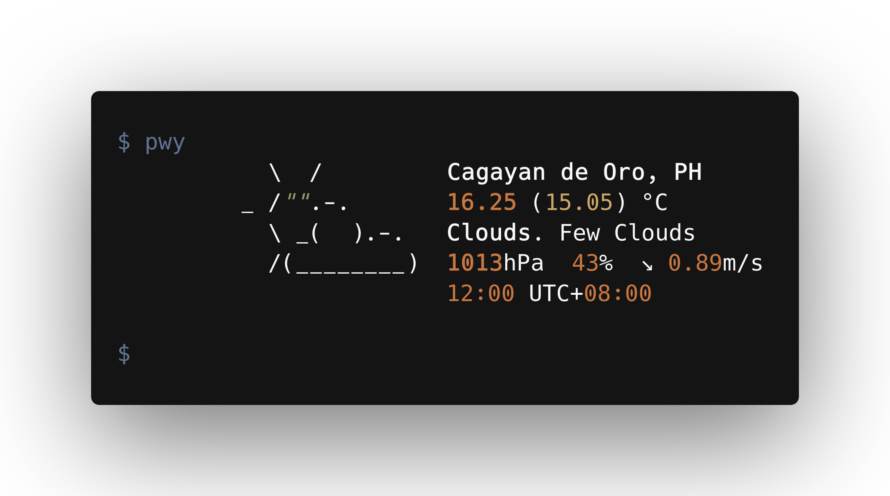

<div align="center">
    <h1>pwy</h1>
    <p>A simple weather information tool.</p>
    <br>
    <a href="https://pypi.org/project/pwy"></a>
    <a href="https://openweathermap.org/api"></a>
    <a href="#"></a>
    <a href="https://github.com/cliegargo/pwy/blob/master/LICENSE"></a>
</div>

## Table of Contents

- [Features](#features)
- [Dependencies](#dependencies)
- [Installation](#installation)
- [Usage](#usage)
- [Update](#update)
- [Development](#development)
- [Changelog](#changelog)
- [Credits](#credits)
- [License](#license)

## Features

- ASCII art
- Display weather information
  - The name of the location.
  - Temperature (and what the temperature feels like).
  - Weather and weather description.
  - Wind pressure, humidity, wind direction, and wind speed.
  - Time and timezone of the location.

## Dependencies

- OpenWeatherMap API key
- Python 3.10 or higher
  - requests
  - rich
- Internet connection

## Installation

### Pip install

#### Unix-like | Windows

```sh
pip install pwy
```

### Manual/Git install

#### Unix-like | Windows

Download the latest pwy package [here](https://github.com/cliegargo/pwy/releases/latest) and uncompress it.
Go to pwy directory.

```sh
cd pwy
```

Install pwy.

```sh
pip install .
```

## Configuration

### Unix-like | Windows

Before you can use pwy, you need to configure pwy. Run the command below and fill the required files, these fields are for the OWM API key, location, unit, and language.

```sh
pwy
```

After you're through, the `pwy.json` (`~/.config/pwy.json` for Unix-like and `pwy.json` for Windows) config file, containing your OWM API key, location, unit, and language, will be generated.

Get your OWM key by [signing up](https://home.openweathermap.org/users/sign_up).

If you want to edit your pwy configuration.

```sh
pwy --config
```

## Usage

### Unix-like | Windows

To display weather in your current city (from pwy.json).

```sh
pwy
```

To display weather in your current city.

```sh
pwy tokyo
```

You can also specify what country you are in by.

```sh
pwy tokyo,jp
```

To display weather with specific unit of measurement. By default the unit is Metric system.

```sh
pwy tokyo --unit imperial
```

To display weather with specific language.

```sh
pwy tokyo --lang ja
```

To display help information.

```sh
pwy --help
```

## Availabe options

```sh
usage: __main__.py [-h] [-c] [-u] [-l] [-v] [location ...]

pwy - A simple weather information tool

positional arguments:
  location        input location

options:
  -h, --help      show this help message and exit
  -c, --config    configure pwy
  -u, --unit  input unit
  -l, --lang  input language
  -v, --version   show program's version number and exit
```

## Update

### Unix-like | Windows

```sh
pip install --upgrade pwy
```

## Development

```sh
# Create a virtual environment and enable it.
python3 -m venv
. env/bin/activate

# Install dependencies.
pip install -r requirements.txt
```

## Changelog

View [Changelog](./CHANGELOG.md).

## Credits

- [pwy Contributors](https://github.com/cliegargo/pwy/graphs/contributors)
- [OpenWeatherMap](https://openweathermap.org/current) - API
- [wego](https://github.com/schachmat/wego) - ASCII art

## License

This program is provided under the [MIT License](./LICENSE).
